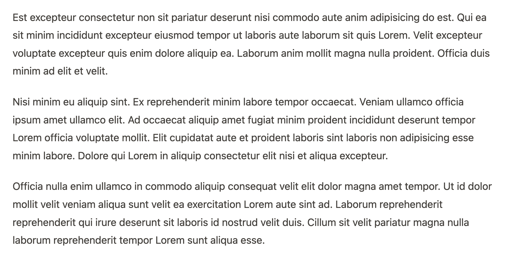

# Lorem Ipsum for MyST Markdown by Curvenote

> In publishing and graphic design, Lorem ipsum is a placeholder text commonly used to demonstrate the visual form of a document or a typeface without relying on meaningful content. -- [Wikipedia](https://en.wikipedia.org/wiki/Lorem_ipsum)

Adding this [plugin](https://mystmd.org/guide/plugins) to your MyST Markdown project will add a new `lorem` directive.


The following directive...

```
:::{lorem} 3
:::
```

...will add 3 paragraphs of Lorem Ipsum text to the page, somehting like this:



## Setup and Usage

This package is published on `npm`, to install the plugin in your MyST project:

1. Download the javascript module (`lorem.mjs`) from [https://unpkg.com/browse/myst-spec-lorem@latest/dist/lorem.mjs](https://unpkg.com/browse/myst-spec-lorem@latest/dist/lorem.mjs) and save this in your project folder
1. Add the module to the list of plugins in `myst.yml`:

```yaml
project:
  plugins:
    - lorem.mjs
```

The plugin will be loaded when you next run `myst start`

```sh
myst start

🔌 Lorem Ipsum (lorem.mjs) loaded: 1 directive, 0 roles, 0 transforms
📖 Built example.md in 4.68 ms.
📚 Built 1 page for project in 30 ms.


        ✨✨✨  Starting Article Theme  ✨✨✨


🔌 Server started on port 3001!  🥳 🎉


        👉  http://localhost:3001  👈

```

Then add `lorem` or `lipsum` directives to your page where ever you need them.

```
:::{lorem} 4
:::
```

The directive takes a single argument which controls the number of paragraphs to add.

> [!TIP]
> MyST Markdown's plugin loading system is still developing, [look out for updates](https://mystmd.org/guide/plugins) on easier ways to access and load plugins.

## Developing

This repo builds the plugin and it's dependencies into a singel javascript module bundle using `tusp`.

1. clone this repo
1. `cd myst-ext-lorem`
1. `npm install`
1. `npm build`

```sh
> myst-ext-lorem@1.0.0 build
> tsup

CLI Building entry: src/lorem.ts
CLI Using tsconfig: tsconfig.json
CLI tsup v8.1.0
CLI Using tsup config: /Users/stevejpurves/dev/myst-ext/myst-ext-lorem/tsup.config.ts
CLI Target: esnext
CLI Cleaning output folder
ESM Build start
ESM dist/lorem.mjs     22.57 KB
ESM dist/lorem.mjs.map 23.16 KB
ESM ⚡️ Build success in 12ms
DTS Build start
DTS ⚡️ Build success in 456ms
DTS dist/lorem.d.ts 452.00 B
```

## Contributing

This plugin uses the [lorem-ipsum](https://www.npmjs.com/package/lorem-ipsum) package by [@knicklabs](https://github.com/knicklabs) which exposes many options, if you think some of these will be useful for Lorem Ipsum in MyST documents, issues and PRs to expose those are welcome!
